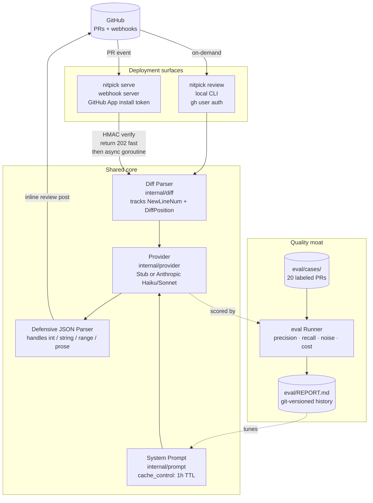
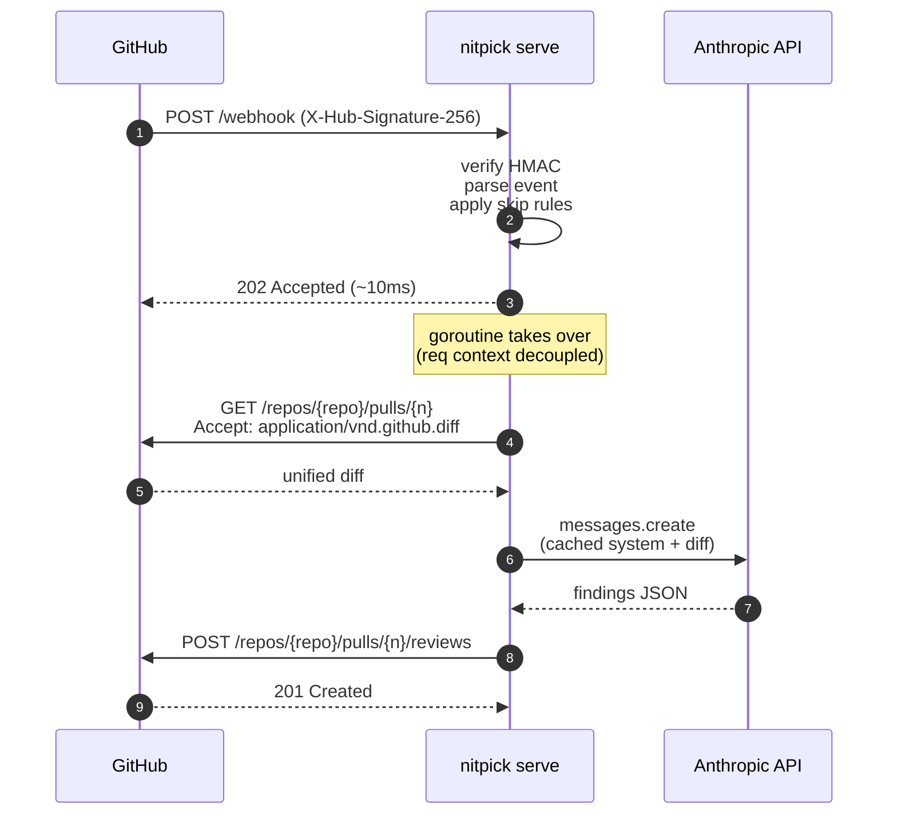

# nitpick

Self-hosted AI code review for GitHub pull requests. Bring your own LLM key; own the pipeline end-to-end.

**Status: v0.2.0** — production-ready webhook server (`nitpick serve`) for hosted GitHub App deployment, or per-repo GitHub Action. Eval harness with 20 labeled PRs and committed prompt-tuning history.

---

## Why

Self-hosted agentic tooling is where developer infrastructure is heading — full control over the prompt, the model, what context flows in, and which repos see what data. nitpick is the smallest useful version of that thesis: a PR reviewer you run on your own infrastructure with your own LLM key.

It's also been an exercise in the engineering discipline this kind of project actually needs:

- Designed to **complement** CodeRabbit (which is well worth its ~$30/dev/mo on team plans), not replace it — the system prompt explicitly skips style/formatting and targets repo-context findings (contract drift, unenforced security gates, perf concerns tied to data shape)
- Eval harness with committed `REPORT.md` history — the tuning loop is the artifact, not vibes
- Anthropic Haiku 4.5 default; escalate to Sonnet 4.6 per repo
- One tool, two deployment shapes (Action or hosted GitHub App), shared core

Cost is incidental, not the pitch — ~$0.007/PR on Haiku, ~$0.029 on Sonnet. The point is owning the pipeline.

## Measured quality

3-run mean per config against 20 hand-labeled merged PRs across 5 real repos (Go / Python / Rails / TypeScript):

| Config | F1 | Precision | Recall (useful) | $/PR |
|---|---|---|---|---|
| Haiku 4.5 (default) | 0.25 | 0.16 | 0.48 | **$0.007** |
| **Sonnet 4.6** | **0.46** | **0.50** | 0.29 | $0.029 |
| Stub (regex floor) | 0.00 | 0.00 | 0.00 | $0 |

The full per-run data lives in [`eval/REPORT.md`](eval/REPORT.md); each commit on that file is one tuning iteration.

---

## Pick your path

### A. Try it on your machine (2 minutes, no API key)

```bash
git clone https://github.com/cjunks94/nitpick && cd nitpick
go build -o nitpick .
GITHUB_TOKEN=$(gh auth token) ./nitpick review --pr <some PR> --repo <owner/name> --provider stub --dry-run
```

The `stub` provider is regex-based, costs nothing, and exists as the eval floor. Useful to confirm the CLI works.

For the real thing:

```bash
export ANTHROPIC_API_KEY=sk-ant-...
./nitpick review --pr <PR> --repo <owner/name> --provider anthropic --dry-run
```

`--dry-run` prints findings to stdout. Drop it to post the review to the PR.

### B. Add to one repo as a GitHub Action

```yaml
# .github/workflows/nitpick.yml
on: pull_request
jobs:
  review:
    runs-on: ubuntu-latest
    permissions:
      pull-requests: write
      contents: read
    steps:
      - uses: cjunks94/nitpick@v0.2.0
        with:
          provider: anthropic
          anthropic-api-key: ${{ secrets.ANTHROPIC_API_KEY }}
```

Set `ANTHROPIC_API_KEY` as a repo or org secret. Auto-runs on every PR. No hosting needed.

### C. Run as a GitHub App, cover N repos (production setup)

One install → many repos, webhook-driven. Deploy `nitpick serve` to Railway / Fly / any container host, register as a GitHub App, tick which repos get coverage.

→ **[`DEPLOY.md`](DEPLOY.md)** has the end-to-end guide (~30 min, three sections: App setup, Railway deploy, repo install).

---

## Architecture

Two deployment shapes (`review` and `serve`) share a single core: diff parser → prompt → LLM → defensive JSON parser → comment formatter. They differ only in **how the diff arrives** and **which credential authorizes the post**.

### System overview



### Async webhook flow

The LLM review takes 5-30s. GitHub's webhook delivery times out at ~10s. So `serve` validates + acknowledges within ~10ms and does the actual review in a goroutine.



### Architectural decisions and trade-offs

| Decision | Alternative considered | Why we chose this |
|---|---|---|
| Stub provider stays forever | Delete once Anthropic ships | It's the **eval floor** — every LLM run must beat it on F1 to justify the tokens |
| Single prompt for both models | Per-model variants | A/B'd 3v3: looser Sonnet prompt got dominated. Measure before splitting |
| Async webhook handler | Synchronous response | GitHub timeout ~10s vs LLM review 5-30s. Required, not optional |
| In-memory dedup with 1h TTL | Postgres-backed dedup | Stateless deploy, restart loses ≤1h. Add DB when duplicates become a real problem |
| `gh` CLI (local) + HTTP (server) | Unify on HTTP everywhere | Different auth models (user PAT vs App installation token); body shape shared via `BuildReviewBody` |
| Per-PR error isolation | Abort sweep on first error | A $0.40 eval sweep lost to a single malformed JSON is unacceptable. Log + record zero findings + continue |
| HMAC sig as the only auth | Add bearer / basic on top | Industry-standard webhook auth. Adding more breaks the integration |
| Prompt in its own package, versioned via constant | Inline string in provider | Prompt diffs in `git log` are clean and pair naturally with `REPORT.md` commits |
| `flexInt` accepts int / string / range | Strict int per JSON schema | Sonnet emitted line numbers in every shape; tightening back loses real eval data |
| SIGTERM graceful shutdown with 30s grace | Hard kill on signal | Railway redeploys SIGTERM; without grace every redeploy loses in-flight reviews |

### Patterns worth noting

These transfer to other LLM-powered services (test triage, log analysis, document QA — any system that calls an LLM in production):

- **Stub as the deterministic floor.** Before the LLM, what's the regex / heuristic baseline? Score against it. If the LLM doesn't beat the stub on F1, you're paying for nothing.
- **Eval as committed code.** A labeled set + a runner + a `REPORT.md` whose git log captures every tuning iteration. Beats screenshots in Notion.
- **Measure precision and recall, not just accuracy.** For most LLM tasks, false-positives kill reader trust faster than false-negatives kill recall. Tune for the one that matters in your domain.
- **Per-item error isolation in batch jobs.** One bad LLM response should log + skip + continue, never abort. The economics demand it.
- **Defensive output parsing.** Whatever your JSON schema says, the model will emit something it doesn't. Build the parser to absorb known drift (line-as-string, line-as-range, prose-before-JSON) rather than fighting it.
- **HMAC for webhook auth.** Stripe, GitHub, Slack — they all do this. Don't bolt extra auth on top of webhooks; bolt it on admin endpoints instead.
- **Async accept-now-work-later for any LLM webhook.** Return 202 fast, decouple the request context, work in a goroutine. Otherwise you'll get retries.
- **Two transports, one body builder.** When you have multiple deployment shapes (CLI + server), share the data construction; vary only the transport.
- **Prompts are model-specific in theory, model-agnostic in practice.** Keep the dispatcher seam (`prompt.For(modelID)`) for future use, but resist the urge to split until A/B data demands it.
- **Cost ceilings are a feature.** A `MaxLinesPerPR` skip rule is the difference between $0.10/month and an accidental $50.

---

## Configuration

`.nitpick.yaml` at repo root (see [`.nitpick.yaml.example`](.nitpick.yaml.example) for the full annotated example):

```yaml
provider: anthropic
model: claude-haiku-4-5           # or claude-sonnet-4-6
review:
  severity_threshold: useful      # nit | useful | critical
  ignore_paths: ["vendor/**", "**/*.lock"]
  context_notes: |
    Language conventions:
      - GDScript: `class_name` is repo-globally resolved.
        Do NOT flag missing imports for repo-local classes.
      - Test framework is GdUnit4 — use before_test/after_test,
        not try/finally (which GDScript doesn't have).
    Things we don't want flagged here:
      - "Add error handling" on signal handlers that intentionally swallow.
```

The `context_notes` field is the key per-repo lever. nitpick fetches `.nitpick.yaml` at the PR head SHA and injects `context_notes` into the reviewer's system prompt as a cached block — treat it as authoritative repo-specific guidance that overrides the bot's defaults. Use it for language conventions (GDScript `class_name`, Rails autoload, Python namespace packages), test-framework specifics, and patterns the team has explicitly opted out of having flagged.

For server-mode env vars (App ID, private key, webhook secret), see [`.env.example`](.env.example) and [`DEPLOY.md`](DEPLOY.md).

---

## Development

```bash
go build ./...                  # compile everything
go test ./...                   # all unit tests
go vet ./...                    # static checks

# Run the eval suite (no API key needed)
./nitpick eval --provider stub

# Real eval against the 20-PR set (Haiku ~$0.15, Sonnet ~$0.60 per sweep)
./nitpick eval --provider anthropic
./nitpick eval --provider anthropic --model claude-sonnet-4-6

# Try with per-repo CLAUDE.md injection (opt-in; A/B'd as no-win, kept for future re-testing)
./nitpick eval --provider anthropic --guidelines
```

Every prompt change in [`internal/prompt/system.go`](internal/prompt/system.go) should be paired with a re-run + commit of `eval/REPORT.md`. The git log of `REPORT.md` is the prompt-tuning artifact you'd point at in an interview.

### Local smoke test of `nitpick serve`

```bash
# Terminal 1: forward GitHub webhooks to localhost via smee.io
# (creates a free, public URL — visit https://smee.io/new to get one)
npx smee-client --url https://smee.io/<your-channel> --target http://localhost:8080/webhook

# Terminal 2: run the server
export ANTHROPIC_API_KEY=sk-ant-...
export GITHUB_APP_ID=123456
export GITHUB_APP_PRIVATE_KEY="$(cat your-app.private-key.pem)"
export GITHUB_WEBHOOK_SECRET=$(openssl rand -hex 32)
./nitpick serve --port 8080
```

Point your GitHub App's webhook URL at the smee channel; open a PR; watch logs.

---

## Project layout

| Path | Purpose |
|---|---|
| `main.go` + `cmd/` | CLI entrypoint and subcommands (review, eval, serve) |
| `internal/diff/` | Unified diff parser (tracks new-file line + per-file diff position) |
| `internal/ghc/` | GitHub plumbing: `gh` CLI wrapper for `review`, HTTPClient for `serve` |
| `internal/ghapp/` | GitHub App auth (JWT minting + installation token caching) |
| `internal/server/` | Webhook server: signature verification, handler, /healthz, SIGTERM shutdown |
| `internal/provider/` | Provider interface; stub + Anthropic implementations |
| `internal/prompt/` | Versioned system prompts (one prompt currently — per-model dispatcher kept) |
| `internal/config/` | `.nitpick.yaml` loader |
| `internal/eval/` | Eval runner — scores providers against labeled PR cases |
| `eval/cases/` | 20 labeled PR diffs + expected findings (committed) |
| `eval/REPORT.md` | Latest eval output — its git history is the prompt-tuning log |
| `Dockerfile` | Multi-stage build; defaults to `serve` (overridden by `action.yml`) |
| `action.yml` | GitHub Action packaging — passes args to override the docker CMD |
| `DEPLOY.md` | Step-by-step GitHub App + Railway deployment guide |
| `HANDOFF.md` | What's shipped, what's tried-and-reverted, what's next |
| `.env.example` | Required env vars for `nitpick serve` |

## Roadmap

Shipped:
- v0.1.0 — Anthropic provider, eval harness, inline-comment posting verified
- v0.2.0 — webhook server, GitHub App auth, Railway-ready

Next (v0.3.x+):
- Model routing — auto-escalate Haiku → Sonnet when changed files match high-risk patterns (`auth/`, `migrations/`, `payments/`)
- Multi-file context — fetch imports/callers of changed files to lift recall on the missed-by-everyone findings
- DeepSeek provider as a cost-optimization comparison point
- Postgres-backed dedup if in-memory becomes lossy in practice

## License

MIT.
