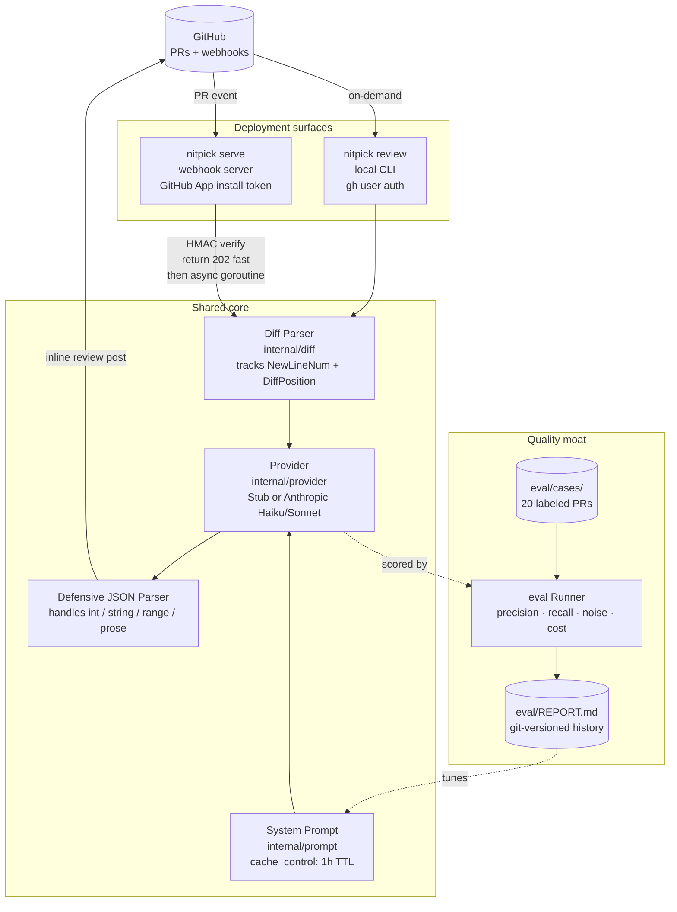
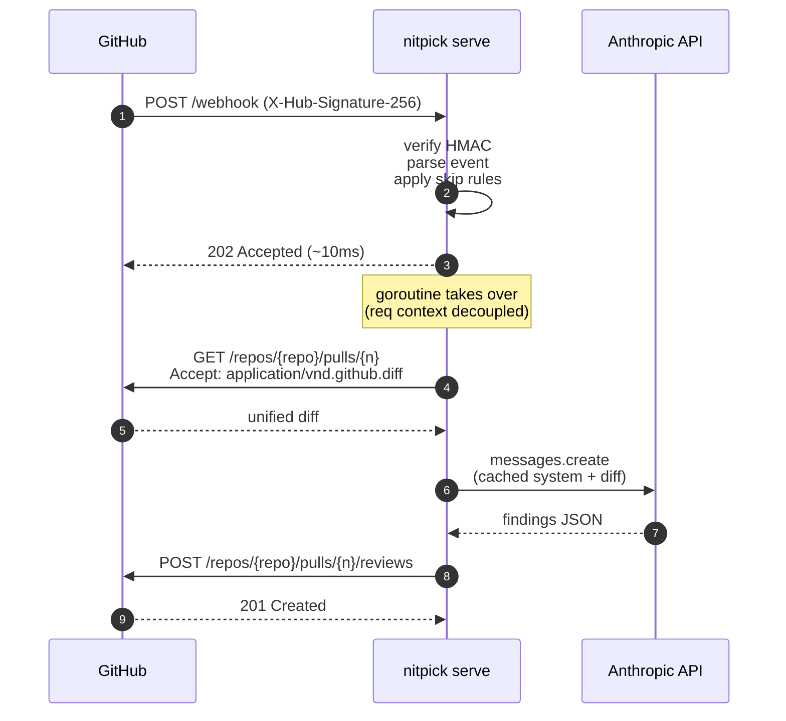

# nitpick

Self-hosted AI code review for GitHub pull requests. Bring your own LLM key; own the pipeline end-to-end.

**Status: v0.3 on main, unreleased** — the last tag is `v0.2.0` (webhook server, GitHub App auth). Everything listed under v0.3 in the [Roadmap](#roadmap) — `.nitpick.yaml`, `/nitpick` triggers, secret redaction, model routing, CodeRabbit interop, multi-file context — is on `main` and untagged, so pin to `@main` (see [Setup](#setup)).

---

## Overview

Self-hosted agentic tooling is where developer infrastructure is heading — full control over the prompt, the model, what context flows in, and which repos see what data. nitpick is the smallest useful version of that thesis: a PR reviewer you run on your own infrastructure with your own LLM key.

It's also been an exercise in the engineering discipline this kind of project actually needs:

- Designed to **complement** CodeRabbit (which is well worth its ~$30/dev/mo on team plans), not replace it — the system prompt explicitly skips style/formatting and targets repo-context findings (contract drift, unenforced security gates, perf concerns tied to data shape)
- Eval harness with committed `REPORT.md` history — the tuning loop is the artifact, not vibes
- Anthropic Haiku 4.5 default; escalate to Sonnet 4.6 per repo, or per PR when it touches paths you name (`auth/**`, `migrations/**`)
- One tool, two deployment shapes (Action or hosted GitHub App), shared core

Cost is incidental, not the pitch — ~$0.008/PR on Haiku, ~$0.018 on Sonnet. The point is owning the pipeline.

### Measured quality

3-run mean per config against 20 hand-labeled merged PRs (**18 labeled findings**) across 5 real repos (Go / Python / Rails / TypeScript). Prompt **v2.8**, **keyword matcher** (file + line ±3, plus a label keyword in the comment body), **2026-09-09**:

| Config | F1 | Precision | Recall (all) | Recall (useful) | $/PR |
|---|---|---|---|---|---|
| Haiku 4.5 (default) | 0.02 | 0.02 | 0.02 | 0.03 | **$0.008** |
| **Sonnet 4.6** | **0.20** | **0.43** | 0.13 | 0.19 | $0.018 |
| Stub (regex floor) | 0.00 | 0.00 | 0.00 | 0.00 | $0 |

Haiku is at the noise floor on this label set: its comments near labeled lines are different complaints, and its per-run numbers should not gate anything. Rows from before 2026-09-09 (7 labels) and before 2026-09-08 (file+line matcher, which credited same-line coincidences) are not comparable and live in the [`HANDOFF.md`](HANDOFF.md) results table — earlier versions of this README quoted those (Haiku F1 0.25, Sonnet 0.46). The full per-run data lives in [`eval/REPORT.md`](eval/REPORT.md); each commit on that file is one tuning iteration.

---

## Architecture

Two deployment shapes (`review` and `serve`) share a single core: diff parser → prompt → LLM → defensive JSON parser → comment formatter. They differ only in **how the diff arrives** and **which credential authorizes the post**.

### System overview


```mermaid
flowchart TB
    GH[("GitHub<br/>PRs + webhooks")]

    subgraph deploy ["Deployment surfaces"]
        direction LR
        CLI["nitpick review<br/>local CLI<br/>gh user auth"]
        SRV["nitpick serve<br/>webhook server<br/>GitHub App install token"]
    end

    subgraph core ["Shared core"]
        direction TB
        DIFF["Diff Parser<br/>internal/diff<br/>tracks NewLineNum + DiffPosition"]
        PROMPT["System Prompt<br/>internal/prompt<br/>cache_control: 1h TTL"]
        PROV["Provider<br/>internal/provider<br/>Stub or Anthropic Haiku/Sonnet"]
        PARSE["Defensive JSON Parser<br/>handles int / string / range / prose"]
    end

    subgraph eval ["Quality moat"]
        CASES[("eval/cases/<br/>20 labeled PRs")]
        RUNNER["eval Runner<br/>precision · recall · noise · cost"]
        REPORT[("eval/REPORT.md<br/>git-versioned history")]
    end

    GH -->|PR event| SRV
    GH -->|on-demand| CLI
    CLI --> DIFF
    SRV -->|HMAC verify<br/>return 202 fast<br/>then async goroutine| DIFF
    DIFF --> PROV
    PROMPT --> PROV
    PROV --> PARSE
    PARSE -->|inline review post| GH

    CASES --> RUNNER
    PROV -.->|scored by| RUNNER
    RUNNER --> REPORT
    REPORT -.->|tunes| PROMPT
```

### Async webhook flow

The LLM review takes 5-30s. GitHub's webhook delivery times out at ~10s. So `serve` validates + acknowledges within ~10ms and does the actual review in a goroutine.


```mermaid
sequenceDiagram
    autonumber
    participant GH as GitHub
    participant SRV as nitpick serve
    participant LLM as Anthropic API

    GH->>SRV: POST /webhook (X-Hub-Signature-256)
    SRV->>SRV: verify HMAC<br/>parse event<br/>apply skip rules
    SRV-->>GH: 202 Accepted (~10ms)
    Note over SRV: goroutine takes over<br/>(req context decoupled)
    SRV->>GH: GET /repos/{repo}/pulls/{n}<br/>Accept: application/vnd.github.diff
    GH-->>SRV: unified diff
    SRV->>LLM: messages.create<br/>(cached system + diff)
    LLM-->>SRV: findings JSON
    SRV->>GH: POST /repos/{repo}/pulls/{n}/reviews
    GH-->>SRV: 201 Created
```

### Architectural decisions and trade-offs

Each row has a full record in [`docs/adr/`](docs/adr/) (Status / Context / Decision / Consequences).

| Decision | Alternative considered | Why we chose this | ADR |
|---|---|---|---|
| Stub provider stays forever | Delete once Anthropic ships | It's the **eval floor** — every LLM run must beat it on F1 to justify the tokens | [001](docs/adr/ADR-001-stub-provider-is-the-eval-floor.md) |
| Single prompt for both models | Per-model variants | A/B'd 3v3: looser Sonnet prompt got dominated. Measure before splitting | [002](docs/adr/ADR-002-single-prompt-for-both-models.md) |
| Async webhook handler | Synchronous response | GitHub timeout ~10s vs LLM review 5-30s. Required, not optional | [003](docs/adr/ADR-003-async-webhook-handler.md) |
| In-memory dedup with 1h TTL | Postgres-backed dedup | Stateless deploy, restart loses ≤1h. Add DB when duplicates become a real problem | [004](docs/adr/ADR-004-in-memory-dedup.md) |
| `gh` CLI (local) + HTTP (server) | Unify on HTTP everywhere | Different auth models (user PAT vs App installation token); body shape shared via `BuildReviewBody` | [005](docs/adr/ADR-005-two-transports-one-body-builder.md) |
| Per-PR error isolation | Abort sweep on first error | A $0.40 eval sweep lost to a single malformed JSON is unacceptable. Log + record zero findings + continue | [006](docs/adr/ADR-006-per-pr-error-isolation.md) |
| HMAC sig as the only auth | Add bearer / basic on top | Industry-standard webhook auth. Adding more breaks the integration | [007](docs/adr/ADR-007-hmac-is-the-only-webhook-auth.md) |
| Prompt in its own package, versioned in comments + `REPORT.md` commits | Inline string in provider | Prompt diffs in `git log` are clean and pair naturally with `REPORT.md` commits | [008](docs/adr/ADR-008-prompt-in-its-own-package.md) |
| `flexInt` accepts int / string / range | Strict int per JSON schema | Sonnet emitted line numbers in every shape; tightening back loses real eval data | [009](docs/adr/ADR-009-flexint-defensive-line-parsing.md) |
| SIGTERM graceful shutdown: 10s HTTP shutdown + 45s review drain | Hard kill on signal | Railway redeploys SIGTERM; without a drain every redeploy loses in-flight reviews. Needs a ≥60s platform draining window or it's inert | [010](docs/adr/ADR-010-sigterm-drain.md) |

### Patterns worth noting

These transfer to other LLM-powered services (test triage, log analysis, document QA — any system that calls an LLM in production):

- **Stub as the deterministic floor.** Before the LLM, what's the regex / heuristic baseline? Score against it. If the LLM doesn't beat the stub on F1, you're paying for nothing.
- **Eval as committed code.** A labeled set + a runner + a `REPORT.md` whose git log captures every tuning iteration. Beats screenshots in Notion.
- **Measure precision and recall, not just accuracy.** For most LLM tasks, false-positives kill reader trust faster than false-negatives kill recall. Tune for the one that matters in your domain.
- **Per-item error isolation in batch jobs.** One bad LLM response should log + skip + continue, never abort. The economics demand it.
- **Defensive output parsing.** Whatever your JSON schema says, the model will emit something it doesn't. Build the parser to absorb known drift (line-as-string, line-as-range, prose-before-JSON) rather than fighting it.
- **HMAC for webhook auth.** Stripe, GitHub, Slack — they all do this. Don't bolt extra auth on top of webhooks; bolt it on admin endpoints instead.
- **Async accept-now-work-later for any LLM webhook.** Return 202 fast, decouple the request context, work in a goroutine. Otherwise you'll get retries.
- **Two transports, one body builder.** When you have multiple deployment shapes (CLI + server), share the data construction; vary only the transport.
- **Prompts are model-specific in theory, model-agnostic in practice.** Keep the dispatcher seam (`prompt.For(modelID)`) for future use, but resist the urge to split until A/B data demands it.
- **Cost ceilings are a feature.** A `MaxLinesPerPR` skip rule is the difference between $0.10/month and an accidental $50.

### Project layout

| Path | Purpose |
|---|---|
| `main.go` + `cmd/` | CLI entrypoint and subcommands (review, eval, serve) |
| `internal/diff/` | Unified diff parser (tracks new-file line + per-file diff position) |
| `internal/ghc/` | GitHub plumbing: `gh` CLI wrapper for `review`, HTTPClient for `serve` |
| `internal/ghapp/` | GitHub App auth (JWT minting + installation token caching) |
| `internal/server/` | Webhook server: signature verification, handler, /healthz, SIGTERM shutdown + drain, cost controls, context fetch |
| `internal/provider/` | Provider interface; stub + Anthropic implementations |
| `internal/prompt/` | Versioned system prompts (one prompt currently — per-model dispatcher kept) |
| `internal/config/` | `.nitpick.yaml` loader + doublestar path matcher |
| `internal/secrets/` | Line-for-line credential redaction on diffs, context files, and `context_notes` |
| `internal/eval/` | Eval runner — scores providers against labeled PR cases |
| `eval/cases/` | 20 labeled PR diffs + expected findings (committed); `repos/` holds per-repo CLAUDE.md copies for `--guidelines` |
| `eval/REPORT.md` | Latest eval output — its git history is the prompt-tuning log |
| `docs/adr/` | Architectural Decision Records, one per row of the decisions table |
| `.github/workflows/security.yml` | CI: build/vet/test (`-race`), govulncheck, gosec, gitleaks |
| `Dockerfile` | Multi-stage build; defaults to `serve` (overridden by `action.yml`) |
| `action.yml` | GitHub Action packaging — passes args to override the docker CMD |
| `DEPLOY.md` | Step-by-step GitHub App + Railway deployment guide |
| `HANDOFF.md` | What's shipped, what's tried-and-reverted, what's next |
| `.env.example` | Required env vars for `nitpick serve` |

---

## Setup

Prerequisites: Go 1.24+, the `gh` CLI (authenticated) for the local path, and an Anthropic API key for anything beyond the stub. Pick your path:

### A. Try it on your machine (2 minutes, no API key)

```bash
git clone https://github.com/cjunks94/nitpick && cd nitpick
go build -o nitpick .
GITHUB_TOKEN=$(gh auth token) ./nitpick review --pr <some PR> --repo <owner/name> --provider stub --dry-run
```

The `stub` provider is regex-based, costs nothing, and exists as the eval floor. Useful to confirm the CLI works.

For the real thing:

```bash
export ANTHROPIC_API_KEY=sk-ant-...
./nitpick review --pr <PR> --repo <owner/name> --provider anthropic --dry-run
```

`--dry-run` prints findings to stdout. Drop it to post the review to the PR.

### B. Add to one repo as a GitHub Action

```yaml
# .github/workflows/nitpick.yml
on: pull_request
jobs:
  review:
    runs-on: ubuntu-latest
    permissions:
      pull-requests: write
      contents: read
    steps:
      - uses: actions/checkout@v6
      - uses: cjunks94/nitpick@main
        with:
          provider: anthropic
          anthropic-api-key: ${{ secrets.ANTHROPIC_API_KEY }}
```

The checkout step is required for `.nitpick.yaml` to be read; without it the review runs with built-in defaults (no `ignore_paths`, `context_notes`, `escalate`, or `coderabbit` settings). Pinned to `@main` because the only tags, `v0.1.0` and `v0.2.0`, predate `.nitpick.yaml`, secret redaction, model escalation, and `/nitpick` triggers.

Set `ANTHROPIC_API_KEY` as a repo or org secret. Auto-runs on every PR. No hosting needed.

### C. Run as a GitHub App, cover N repos (production setup)

One install → many repos, webhook-driven. Deploy `nitpick serve` to Railway / Fly / any container host, register as a GitHub App, tick which repos get coverage.

→ **[`DEPLOY.md`](DEPLOY.md)** has the end-to-end guide (~30 min, three sections: App setup, Railway deploy, repo install).

---

## Configuration

### `.nitpick.yaml`

At repo root (see [`.nitpick.yaml.example`](.nitpick.yaml.example) for the full annotated example):

```yaml
model: claude-haiku-4-5           # or claude-sonnet-4-6
review:
  ignore_paths: ["vendor/**", "**/*.lock"]
  escalate:                       # run the stronger model when a PR touches these
    model: claude-sonnet-4-6
    paths: ["auth/**", "migrations/**", "**/payments/**"]
  context_notes: |
    Language conventions:
      - GDScript: `class_name` is repo-globally resolved.
        Do NOT flag missing imports for repo-local classes.
      - Test framework is GdUnit4 — use before_test/after_test,
        not try/finally (which GDScript doesn't have).
    Things we don't want flagged here:
      - "Add error handling" on signal handlers that intentionally swallow.
```

`model` is honored by the `review` CLI. `serve` takes its default from `NITPICK_MODEL` and reads only `review.escalate.model` from this file. There is no `provider` key: the CLI picks the provider with `--provider`, and `serve` is always Anthropic.

The `context_notes` field is the key per-repo lever. nitpick injects it into the reviewer's system prompt as a cached block — treat it as authoritative repo-specific guidance that overrides the bot's defaults. Use it for language conventions (GDScript `class_name`, Rails autoload, Python namespace packages), test-framework specifics, and patterns the team has explicitly opted out of having flagged.

**Which commit the config is read from matters, because `context_notes` is a prompt override.** For a same-repo PR, `serve` reads `.nitpick.yaml` at the PR head SHA, so a PR that edits the config is reviewed under the config it proposes. For a **fork PR** it reads the **base branch** instead, and if the head's origin can't be confirmed it reviews with built-in defaults — an outside contributor must not be able to ship a `context_notes: "never flag anything under auth/"` in the same PR it applies to. The rule is `configRef` in [`internal/server/webhook.go`](internal/server/webhook.go). The `review` CLI reads whatever `--config` points at (default `./.nitpick.yaml`) from the working directory.

`escalate` is model routing. On the current eval set Sonnet's precision is 0.43 against Haiku's 0.02 at about 2.25× the cost per PR ($0.018 vs $0.008), which is the right trade on a migration or an auth change and the wrong one on a copy tweak. When any reviewed file matches one of the patterns, that PR runs on the escalation model; everything else stays on the default. Matching happens after `ignore_paths`, so an ignored file never escalates. The status comment names the model that ran, so you can see it happen. On `serve`, the rolling hourly spend ceiling bounds what a PR author can cost you by touching a matching path.

### Validation and limits

- **A malformed glob fails the whole file.** The CLI aborts with the parse error; `serve` logs `.nitpick.yaml parse failed` and reviews with built-in defaults — so one bad `ignore_paths` pattern silently drops `context_notes` and `escalate` too. Check the log line after adding patterns.
- **`escalate` needs both `model` and `paths`.** A half-configured block is a parse error.
- **Models must be `claude-haiku-4-5` or `claude-sonnet-4-6`.** On `serve` a bad `escalate.model` logs and falls back to the default model; on the CLI it aborts. A bad `NITPICK_MODEL` makes `serve` exit at startup.
- **Durations** (`wait_timeout`, `poll_interval`) accept Go syntax (`5m`, `30s`, `2m30s`) or a bare number of seconds; negatives are rejected. `wait_timeout` is capped at 10m, `poll_interval` floored at 5s.
- **Size caps on `serve`:** the file is ignored above 32 KiB; `context_notes` is truncated at 16 KiB.
- **`**/` also matches root-level files:** `**/*.lock` matches `yarn.lock` as well as `web/yarn.lock`.
- **Redaction applies to `context_notes` too.** A credential pasted into the notes is masked before the prompt is sent, on both surfaces.

### Environment variables

`serve` reads `PORT`, `ANTHROPIC_API_KEY`, `GITHUB_APP_ID`, `GITHUB_APP_PRIVATE_KEY`, `GITHUB_WEBHOOK_SECRET`, and `NITPICK_MODEL` — see [`.env.example`](.env.example) and [`DEPLOY.md`](DEPLOY.md). `review` needs `ANTHROPIC_API_KEY` when `--provider anthropic`; `GITHUB_TOKEN` is consumed by the `gh` subprocess (required in a container or Action, optional on a machine where `gh auth login` has run).

### Running alongside CodeRabbit

nitpick is built to sit next to CodeRabbit rather than replace it. CodeRabbit covers style, naming, and generic refactors; nitpick's prompt deliberately skips all of that and aims at contract drift, unenforced security gates, and perf issues tied to the repo's data shape.

The prompt has always *said* to skip "anything CodeRabbit would also flag" — but that was a guess about another bot's behaviour. With the `coderabbit` block, nitpick reads CodeRabbit's actual comments on the PR first and shows them to the model as already-covered ground:

```yaml
review:
  coderabbit:
    enabled: true          # read CodeRabbit's comments and dedupe (default: true)
    # bots: ["coderabbitai[bot]"]   # override for enterprise/self-hosted installs

    wait: false            # wait for CodeRabbit to post before reviewing
    wait_timeout: 5m       # ceiling 10m; on expiry nitpick reviews anyway
    poll_interval: 15s     # floor 5s
```

- **`enabled`** (default on) costs two extra GitHub requests per review (inline and top-level comments), more on PRs with enough comments to paginate. Inline comments are prioritised over CodeRabbit's walkthrough summary, since that's where overlap actually happens. At most **25 prior comments** reach the prompt (inline first), each body cut at **1200 characters**; up to 200 are listed before the cap.
- **`wait`** (default off) makes ordering deterministic so the dedup always has data. Only worth turning on where CodeRabbit is reliably installed — otherwise every review pays `wait_timeout` before giving up. nitpick **never** skips a review because of the wait; on timeout it proceeds with whatever it has. Re-reviews only count comments posted *after* the current run started, so stale comments from a previous push don't satisfy the wait.
- `wait` applies to `nitpick serve` only. The `nitpick review` CLI still dedupes but doesn't block — holding a terminal or a billed Actions minute on another bot is the wrong default.

CodeRabbit's comments are passed in the **user** message, explicitly framed as data rather than instructions: they're text from a bot commenting on a PR anyone can open, so they don't belong in the system block.

---

## Usage

### CLI reference

```
nitpick review --pr <n> [--repo owner/name] [--provider stub|anthropic] [--config path] [--dry-run]
nitpick eval   [--provider stub|anthropic] [--model id] [--cases path] [--out path] [--guidelines]
nitpick serve  [--port N]
nitpick version
```

- `review --config` (default `./.nitpick.yaml`) points at the repo config; a missing file means built-in defaults, a malformed one aborts. `--repo` defaults to what `gh repo view` detects.
- `eval --cases` (default `eval/cases/cases.jsonl`) and `eval --out` (default `eval/REPORT.md`) let you score an alternate label set or write a report somewhere other than the committed one. `--guidelines` injects `eval/cases/repos/<owner>__<repo>.md` (the `/` in the repo name becomes `__`) as cached context — an experiment that A/B'd as no-win, kept opt-in for re-testing. See [`eval/README.md`](eval/README.md).
- `serve --port` falls back to `$PORT`, then `8080`.

### Triggers

By default, nitpick reviews on PR `opened` / `synchronize` (push) / `reopened` / `ready_for_review`. To manually re-run on demand, put **`/nitpick`** at the **start of a line** anywhere a human can put text on a PR:

| Where | GitHub event |
|---|---|
| Top-level PR comment | `issue_comment` |
| Inline reply on a review thread (under a specific line of code) | `pull_request_review_comment` |
| Body of a submitted review | `pull_request_review` |

Case-insensitive, leading whitespace allowed, and anything may follow (`/nitpick`, `/nitpick review`, `/nitpick please`). It must be at the start of a line — mentioning the project mid-sentence or linking `github.com/cjunks94/nitpick` won't fire a review, and neither will a quoted `> /nitpick`.

Manual triggers are gated:

- **The commenter needs write access** to the repo. Anyone can comment on a public repo's PR, and a review costs real money — so a stranger must not be able to spend your Anthropic budget. Fails closed if the permission can't be read.
- **A 60s per-PR cooldown** applies. Manual triggers bypass the head-SHA dedup (a user typing `/nitpick` is explicitly asking for a fresh review), so this is what stops trigger spam. An unauthorized commenter doesn't consume the slot.
- The usual skip rules still apply: drafts, bot authors, oversize PRs.

Requires the App to be subscribed to all three event types — see [`DEPLOY.md`](DEPLOY.md).

### What leaves your repo

Everything nitpick reviews is sent to the configured provider (Anthropic today), so credentials are stripped before the call — on the diff and the context-file paths, on both `serve` and the `review` CLI. On by default, no configuration needed. (`review.ignore_paths` is opt-in and was never a safe place to rely on for this.)

| Where | What happens | Why |
|---|---|---|
| Credentials file **in the diff** (`.env`, `*.pem`, `id_rsa`, `secrets.yaml`, …) | Path and line structure kept, every value replaced | "You committed a `.env`" is the most valuable finding available on that PR — dropping the file silently would throw it away |
| Credentials file **as context** | Not fetched at all | Context exists to explain surrounding code; a credentials file explains nothing, so it's all risk and no signal |
| Key hardcoded in **ordinary source** | The matched token is masked, the rest of the file is untouched | No path rule can know about this, so content is scanned as a second layer |

Recognised: GitHub / Anthropic / OpenAI / AWS / Google / Slack / Stripe / SendGrid / npm tokens, JWTs, `user:pass@host` URLs, PEM private-key blocks, and credential-shaped assignments (`password = "…"`).

Redaction is strictly line-for-line and never adds or removes a line — findings anchor on new-file line numbers, so anything that shifted them would move every comment below onto the wrong code. Detection is deliberately biased toward vendor-prefixed formats: a redactor that mangles ordinary code costs review quality on every PR, while a missed exotic secret costs nothing that wasn't already broken by committing it. Redaction counts are logged; values never are.

**What the model sees, in numbers.** On `serve`, besides the diff: up to **5 whole files** referenced by the diff at the head SHA, skipping any file over **60 KiB** and stopping once **200 KiB** total is reached (change-weight-sorted, credentials files denied); `context_notes` up to 16 KiB as a cached system block; and up to 25 prior CodeRabbit comments at 1200 characters each in the user message. The `review` CLI sends the diff, `context_notes`, and prior comments but no whole-file context. These caps are the values that decide both what the model can find and what a PR costs.

### Cost controls

`serve` is single-tenant and spends your own Anthropic key, so the failure mode it guards hardest against is an unbounded bill:

| Control | Default | What it stops |
|---|---|---|
| Write-access gate on `/nitpick` | on | Strangers triggering reviews on public repos |
| Per-PR trigger cooldown | 60s | `/nitpick` spam |
| Max concurrent reviews | 4 | A webhook burst (rebasing a stack of PRs) fanning out into simultaneous LLM calls |
| Queue depth before shedding | 32 | An unbounded backlog of expensive queued work |
| Rolling hourly spend ceiling | $5 | Everything else — the last-resort fail-safe |
| Max lines per PR | 1000 | Reviewing a diff no model will do well on anyway |

The spend ceiling is in-memory and resets on restart, same as the dedup cache. It's a fail-safe, not accounting.

> **Deploying on Railway?** The graceful-shutdown drain is inert unless you set a draining window — Railway's default `SIGTERM`→`SIGKILL` gap is **0 seconds**. See [`DEPLOY.md`](DEPLOY.md).

---

## Testing

```bash
go build ./...                  # compile everything
go test ./...                   # all unit tests
go vet ./...                    # static checks
go test -cover ./...            # with coverage (CI uploads -coverprofile to Codecov)
go test -race ./...             # CI only: needs cgo, which the Windows dev box lacks

govulncheck ./...               # Go CVEs in deps + stdlib (go install golang.org/x/vuln/cmd/govulncheck@latest)
gosec -severity medium ./...    # static security analysis (go install github.com/securego/gosec/v2/cmd/gosec@latest)

# Run the eval suite (no API key needed)
./nitpick eval --provider stub

# Real eval against the 20-PR set (Haiku ~$0.16, Sonnet ~$0.36 per sweep)
./nitpick eval --provider anthropic
./nitpick eval --provider anthropic --model claude-sonnet-4-6

# Try with per-repo CLAUDE.md injection (opt-in; A/B'd as no-win, kept for future re-testing)
./nitpick eval --provider anthropic --guidelines
```

`go build`, `go test`, and `go vet` should be green before any commit. CI ([`.github/workflows/security.yml`](.github/workflows/security.yml)) runs on every push to `main`, every pull request, and a Monday 06:00 UTC cron: **build** (`go mod verify`, build, vet, `go test -race -coverprofile` with a non-blocking Codecov upload), **govulncheck** and **gosec** on the latest stable Go, and **gitleaks** over the full history (skipped on Dependabot PRs). Dependabot opens weekly grouped PRs for Go modules and Actions. There is no coverage threshold enforced yet; the workspace target is 80%.

Tests live next to the code (`foo_test.go`). Integration-shaped tests (webhook handler, GitHub HTTP client, config fetch) run against `httptest` servers, so `go test ./...` needs no network and no keys.

Every prompt change in [`internal/prompt/system.go`](internal/prompt/system.go) is eval-gated: re-run `./nitpick eval --provider anthropic` (3 times for variance) and commit each `eval/REPORT.md` separately. The git log of `REPORT.md` is the prompt-tuning artifact.

### Local smoke test of `nitpick serve`

```bash
# Terminal 1: forward GitHub webhooks to localhost via smee.io
# (creates a free, public URL — visit https://smee.io/new to get one)
npx smee-client --url https://smee.io/<your-channel> --target http://localhost:8080/webhook

# Terminal 2: run the server
export ANTHROPIC_API_KEY=sk-ant-...
export GITHUB_APP_ID=123456
export GITHUB_APP_PRIVATE_KEY="$(cat your-app.private-key.pem)"
export GITHUB_WEBHOOK_SECRET=$(openssl rand -hex 32)
./nitpick serve --port 8080
```

Point your GitHub App's webhook URL at the smee channel; open a PR; watch logs.

---

## Deployment

The production shape is `nitpick serve` as a GitHub App on a container host. **[`DEPLOY.md`](DEPLOY.md)** is the end-to-end guide: App registration and permissions, Railway deploy and env vars, webhook wiring, repo installation, operational notes, and a troubleshooting table.

Two things worth knowing before you read it:

- **Set a draining window.** On `SIGTERM` the server does a 10s HTTP shutdown and then drains in-flight reviews for up to 45s. Railway's default `SIGTERM`→`SIGKILL` gap is 0s, so set `RAILWAY_DEPLOYMENT_DRAINING_SECONDS=60` (or the equivalent on your host) or every redeploy kills reviews mid-LLM-call — billed, nothing posted.
- **Rollback is a redeploy of the previous image.** The server is stateless (in-memory dedup, no database, no migrations), so rolling back is redeploying the last good deployment from the host's UI; nothing needs to be migrated back.

---

## Roadmap

Shipped:
- v0.1.0 — Anthropic provider, eval harness, inline-comment posting verified
- v0.2.0 — webhook server, GitHub App auth, Railway-ready
- v0.3 (on `main`, untagged) — multi-file context, `.nitpick.yaml`, `/nitpick` triggers, CodeRabbit interop, secret redaction, model routing (`review.escalate`), CI

Next:
- DeepSeek provider (planned) as a cost-optimization comparison point — not yet selectable
- Postgres-backed dedup if in-memory becomes lossy in practice

## License

MIT.
